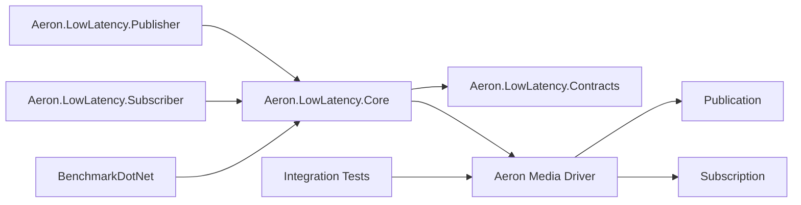

# Aeron Low Latency Dotnet

> Note
>
> This repository is for the technical research of Amirhossein Tohidi.
> It is a practical code sample for learning Aeron through real implementation, integration tests, load tests, and performance benchmarks.

A focused .NET 10 Aeron sample built with the Aeron .NET Client, compact binary message encoding, structured logging, OpenTelemetry metrics, Testcontainers-backed integration tests, Docker Compose, and BenchmarkDotNet.

The project is intentionally about Aeron only. It does not implement Kafka, brokers, event sourcing, Clean Architecture, or a theoretical messaging abstraction. The goal is to keep the Aeron concepts visible in code.

## Problem Statement Covered

This project is based on a low-latency messaging research exercise. The requested system is a practical repository that helps validate Aeron behavior by actually publishing and consuming messages.

The exercise asks for a project that covers:

- Compact binary order messages.
- IPC and UDP Aeron channels.
- Publication offer handling.
- Subscriber polling and decoding.
- Backpressure retry behavior.
- Throughput and latency measurement.
- Multi-subscriber behavior.
- Testcontainers-backed integration tests.
- Heavy load tests excluded from CI by default.
- BenchmarkDotNet reports for encoding, throughput, and latency.

The implementation in this repository chooses the following model:

- One focused order message contract.
- One reusable Aeron core project.
- Thin publisher and subscriber console applications.
- Real Aeron integration tests where the runtime environment supports shared Aeron directories correctly.
- Docker-based Media Driver setup documented clearly for local research.

## Requirement Mapping

| Requirement | Implementation |
| --- | --- |
| Order message model | `OrderMessage`, `OrderSide`, and `OrderMessageCodec`. |
| Binary encoding | Fixed compact payload with little-endian primitives and scaled decimal price. |
| Default IPC channel | `AeronChannels.Ipc` uses `aeron:ipc`. |
| UDP support | CLI accepts `--channel "aeron:udp?endpoint=localhost:40123"`. |
| Default stream id | `AeronSettings.StreamId = 1001`. |
| Publication offer handling | `OrderPublisher` handles success, back pressure, not connected, admin action, closed, and max position exceeded. |
| Retry/backoff | Publisher retries transient offer failures and times out cleanly when a publication never connects. |
| Subscriber stats | `OrderSubscriber` records count, throughput, min, max, average, p50, p95, and p99 latency. |
| Observability | Structured logging, `ActivitySource`, and OpenTelemetry metrics. |
| Integration tests | `tests/Aeron.LowLatency.IntegrationTests` uses a real Java Aeron Media Driver. Linux uses Testcontainers; Windows uses a local driver because Aeron IPC needs host-local shared memory. |
| Load tests | `HighVolumePubSubTests` is marked with `Category=LoadTests`. |
| Benchmarks | Encoding, publishing throughput, and end-to-end latency benchmarks. |
| CI | GitHub Actions restores, builds, and runs tests excluding load tests. |

## Key Flows

### Publish Orders

1. CLI arguments are mapped into `AeronSettings`.
2. `OrderPublisher` connects to the Media Driver.
3. A publication is created for channel and stream id.
4. Warmup messages are optionally published.
5. Each order is encoded into a compact binary buffer.
6. `Publication.Offer` is retried on transient pressure.
7. Published message metrics are recorded.

### Receive Orders

1. `OrderSubscriber` connects to the same Media Driver.
2. A subscription is created for channel and stream id.
3. The subscription is polled with a `FragmentHandler`.
4. Each fragment is decoded into an `OrderMessage`.
5. Ordering and latency are tracked.
6. Throughput and latency stats are logged every second.

### Load Testing

1. Testcontainers starts a real Aeron Media Driver.
2. Subscriber starts first.
3. Publisher sends a large sequential stream.
4. Tests assert full delivery and ordering.
5. Throughput and latency are printed to xUnit output.

## Goals

- Learn Aeron by running actual publications and subscriptions.
- Keep the code small enough that Aeron behavior stays obvious.
- Avoid JSON and use compact binary payloads.
- Reduce avoidable allocations in hot paths.
- Validate behavior with integration tests instead of fake in-memory messaging.
- Separate normal tests from heavy load tests.
- Keep benchmark results local and hardware-specific.
- Make Docker limitations explicit instead of hiding them.

## Architecture



## Project Structure

| Project | Responsibility |
| --- | --- |
| `Aeron.LowLatency.Contracts` | Order contracts and compact binary codec. |
| `Aeron.LowLatency.Core` | Aeron settings, publisher, subscriber, metrics, latency, and throughput helpers. |
| `Aeron.LowLatency.Publisher` | Console publisher CLI. |
| `Aeron.LowLatency.Subscriber` | Console subscriber CLI. |
| `tests/Aeron.LowLatency.IntegrationTests` | Real Aeron integration and load tests. |
| `benchmarks/Aeron.LowLatency.Benchmarks` | BenchmarkDotNet encoding, throughput, and latency benchmarks. |
| `docs` | Architecture, performance notes, test strategy, and Aeron concepts. |

## Core Capabilities

- Publish order messages through Aeron.
- Consume order messages through Aeron.
- Use IPC by default.
- Switch to UDP by channel argument.
- Retry on backpressure.
- Fail clearly when a publication cannot connect.
- Track throughput and latency percentiles.
- Export OpenTelemetry metrics.
- Run Docker-backed integration tests.
- Run local performance benchmarks.

## Configuration

Default settings:

| Setting | Default |
| --- | --- |
| Channel | `aeron:ipc` |
| UDP example | `aeron:udp?endpoint=localhost:40123` |
| StreamId | `1001` |
| MessageCount | `10000` |
| BatchSize | `256` |
| ConnectionTimeout | `30 seconds` |

## Run Locally

Start the Aeron Media Driver:

```bash
docker compose up aeron-media-driver
```

Run the subscriber:

```bash
dotnet run -c Release --project src/Aeron.LowLatency.Subscriber -- \
  --message-count 10000 \
  --aeron-dir <aeron-dir>
```

Run the publisher:

```bash
dotnet run -c Release --project src/Aeron.LowLatency.Publisher -- \
  --message-count 10000 \
  --warmup-count 1000 \
  --aeron-dir <aeron-dir>
```

Run the full Docker Compose setup:

```bash
docker compose up --build
```

## Publisher

```bash
dotnet run -c Release --project src/Aeron.LowLatency.Publisher -- \
  --message-count 100000 \
  --batch-size 1024 \
  --channel "aeron:ipc" \
  --stream-id 1001 \
  --warmup-count 10000
```

UDP example:

```bash
dotnet run -c Release --project src/Aeron.LowLatency.Publisher -- \
  --channel "aeron:udp?endpoint=localhost:40123"
```

## Subscriber

```bash
dotnet run -c Release --project src/Aeron.LowLatency.Subscriber -- \
  --message-count 100000 \
  --batch-size 1024 \
  --channel "aeron:ipc" \
  --stream-id 1001
```

## Tests

Run normal tests:

```bash
dotnet test Aeron.LowLatency.slnx -c Release --filter "Category!=LoadTests"
```

Run load tests:

```bash
dotnet test tests/Aeron.LowLatency.IntegrationTests/Aeron.LowLatency.IntegrationTests.csproj \
  -c Release \
  --filter "Category=LoadTests"
```

Integration tests use a real Java Aeron Media Driver.

On Linux, tests start the driver through Testcontainers by default. CI sets `AERON_USE_LOCAL_DRIVER=true` and uses a local Java 21 Media Driver so `cnc.dat` is owned by the test runner user.

On Windows, tests start a local Java Media Driver because Aeron IPC coordinates through memory-mapped files and Docker Desktop Linux bind mounts do not provide reliable host-local driver heartbeats for the .NET client. If Java 17+ is not available, the fixture downloads a portable Temurin JRE 21 into the user-local cache.

## Benchmarks

Start a Media Driver first, then run:

```bash
dotnet run -c Release --project benchmarks/Aeron.LowLatency.Benchmarks -- \
  --artifacts benchmarks/results
```

BenchmarkDotNet writes reports under `benchmarks/results`.

## Example Output

```text
Received=100000 throughput=251234 msg/sec latency(ns) min=12000 avg=83320 p50=61000 p95=181000 p99=320000 max=2500000
Published 100000 messages to aeron:ipc/1001; backpressure=12, notConnected=0, adminAction=1
```

## Engineering Standards

- Keep the project focused on Aeron.
- Do not hide Aeron behind generic messaging abstractions.
- Prefer simple code over layered architecture.
- Use binary encoding for hot paths.
- Use named arguments where the call is sensitive.
- Treat warnings as errors.
- Keep heavy tests outside default CI.
- Document runtime limitations honestly.

## Known Limitations

- Docker Desktop on Windows is not used for IPC integration tests because the Media Driver and .NET client coordinate through shared files and memory-mapped buffers.
- Linux local runs keep the Testcontainers path by default.
- GitHub Actions uses `AERON_USE_LOCAL_DRIVER=true` with Temurin Java 21 to avoid root-owned `cnc.dat` files from container bind mounts.
- Windows local tests use a Java Media Driver process and may download a portable JRE 21 into `%LOCALAPPDATA%/aeron-low-latency-dotnet`.
- Latency tests collect percentiles but do not enforce strict thresholds.
- The codec is intentionally custom and compact; SBE is the production-grade next step.
- Benchmarks are hardware, OS, Docker, and CPU-governor sensitive.

## Current Status

Implemented:

- .NET 10 solution and project structure.
- Compact binary order codec.
- Aeron publisher and subscriber.
- Publication offer result handling.
- Backpressure retry/backoff.
- Structured logging.
- ActivitySource and OpenTelemetry metrics.
- Testcontainers-backed integration tests.
- Heavy load test category.
- BenchmarkDotNet benchmark project.
- Docker Compose Media Driver setup.
- GitHub Actions CI excluding load tests.
- Architecture, performance, test strategy, and Aeron concept documentation.

Planned next:

- Aeron Archive.
- Aeron Cluster.
- SBE encoding.
- Bare-metal Linux tuning.

## License

This project is licensed under the terms of the repository license.
